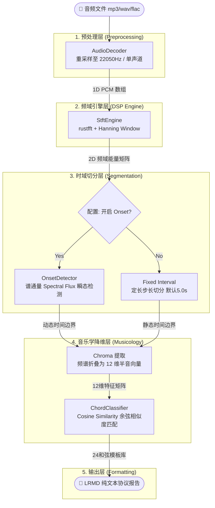

# SonicBridge 核心系统架构设计 (Architecture)

SonicBridge 旨在成为 LLM 与物理音乐世界之间的“降维桥梁”。它的核心设计哲学是**零模型依赖、纯数学计算、极速特征抽取**。

为了实现极低的运行时开销以及高度可控的输出，SonicBridge 完全基于经典的数字信号处理 (DSP) 与音乐信息检索 (MIR) 算法构建，用 Rust 编写以压榨硬件极限性能。

---

## 整体流水线架构 (Pipeline)

数据在系统中的流转分为以下几个阶段：音频解码 -> 频域变换 -> 时域切分 -> 特征降维 -> 协议格式化。



---

## 核心算法模块深度剖析

### 1. 短时傅里叶变换 (STFT)
- **位置**：`src/dsp/spectrogram.rs`
- **原理**：将一维的时域波形数据转换到二维的时频域 (Time-Frequency Domain)。
- **实现细节**：利用了底层高度优化的 `rustfft` 库。为了防止频谱泄漏 (Spectral Leakage)，在每个 FFT 窗口上加了 **汉宁窗 (Hanning Window)**。它生成的 Spectrogram (语谱图) 是后续所有算法分析的基石。

### 2. 自适应瞬态事件切分 (Onset Detection) - 方案 B
- **位置**：`src/dsp/onset.rs`
- **原理**：通过计算 **谱通量 (Spectral Flux)** 来寻找音乐中的物理突变点（如强烈的鼓点、重音的切入）。
- **实现细节**：算法通过比较连续两个时间帧的幅度谱，只累加正向增加的能量差。如果某处的能量突增越过了配置的 `onset_threshold`，系统就会标记一个 Onset 边界。这使得系统不再局限于死板的“每 5 秒一段”，而是真正顺应音乐节拍和乐句进行智能切块，非常适合复杂流行乐。

### 3. 色度向量与极速和弦分类 (Chroma & Chord Classification)
- **位置**：`src/musicology/chroma.rs`
- **降维魔法**：人类的听觉具有倍频程等价性（Octave Equivalence，比如 C3 和 C4 听起来是同一个音名）。算法将几十上百个频段的能量，折叠（折叠相加）到 12 个基础半音音阶（C, C#, D...）上，这就是 12 维的 Chroma 向量。这极大压缩了信息量。
- **模板匹配算法**：系统内存中常驻 24 个预计算的归一化和弦模板（12 种大三和弦 Major，12 种小三和弦 Minor）。针对每一个时间片段，计算提取出的 Chroma 向量与这 24 个模板的 **余弦相似度 (Cosine Similarity)**，得分最高且超出阈值的，即为当前主导和弦。如果整体能量极低，则判定为 `Silent`。

### 4. 动态时间规整与多版本对齐 (DTW Alignment)
- **位置**：`src/alignment/dtw.rs`
- **原理**：用于解决翻唱（Cover）与原唱（Original）之间的微小速度差异和停顿不一致问题。
- **实现细节**：经典的双回溯 DTW 算法。通过构建局部的距离矩阵 (Distance Matrix) 和累积代价矩阵 (Cost Matrix)，利用动态规划寻找一条从 `(0,0)` 到 `(n,m)` 的代价最小的最优扭曲路径 (Warping Path)。从而将两条在时间轴上无法直接对应的信号拉扯对齐。

---

## 目录结构概览

```text
sonic-bridge/
├── Cargo.toml            # 依赖管理与项目元数据
├── src/
│   ├── main.rs           # CLI 入口与参数解析
│   ├── lib.rs            # 模块导出树
│   ├── config.rs         # XDG 规范配置加载 (TOML解析)
│   ├── pipeline.rs       # 核心调度器 (串联所有模块)
│   ├── decoder.rs        # 音频 IO 与重采样 (symphonia)
│   ├── dsp/              # 数字信号处理核心
│   │   ├── spectrogram.rs# FFT 引擎
│   │   └── onset.rs      # 瞬态突变检测
│   ├── musicology/       # 音乐学特征解析
│   │   └── chroma.rs     # 和声与调性分析
│   └── alignment/        # 双轨比对算法
│       └── dtw.rs        # 动态时间规整
└── tests/                # TDD 驱动的全套单元测试
```
